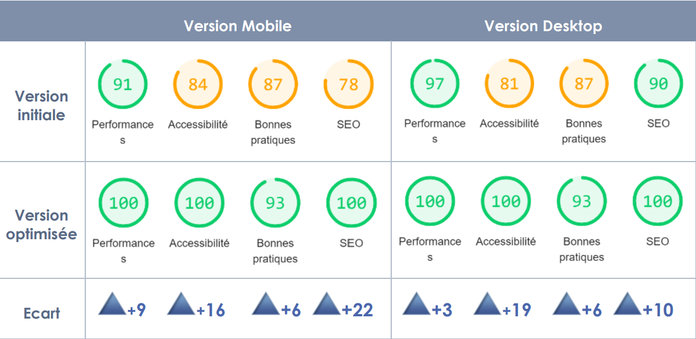

# La Chouette Agence | Optimization of an existing website

This is the **4th** project of the web developer program from OpenClassrooms.

La Chouette Agence is a web design agency located in Lyon. 

Aim of the project was to optimize La Chouette Agence website in order to improve its **SEO ranking**, **performances** and **accessibility**. The code source of the [non-optimized version](https://s3-eu-west-1.amazonaws.com/course.oc-static.com/projects/GEN_integrateur_web_P4/Starting+website.zip) was provided.

## Skills

:white_check_mark: Website audit for SEO, performances and best practices usign Google Lighthouse

:white_check_mark: Ensure accessibility (WCAG standards)

:white_check_mark: Ensure design consistency on a website

:white_check_mark: Write a comparison analysis report

## Features

### Content

1. Header
* header is present on **all pages** and contains the **logo** Ohmyfood
* menu pages contain a **return arrow** to home page

2. Homepage
* displays the **location of restaurants** (location setting not functional)
* includes a short **presentation** of the company
* includes four restaurants cards, **clickable** in their entirety and **redirecting** user to respective **menu page**

3. Restaurants pages
* 4 pages each containing their respective **menu**

4. Footer
* **identical footer** on all pages
* **the contact link** is clickable and linked to an email address

## Animations

1. Homepage
* **custom loading spinner** appears for 3 seconds before displaying the homepage

2. Buttons
* on hover, background color lightens slightly and drop shadow becomes more visible
* on click, heart-shaped like buttons fill up with gradient color

3. Menu pages
* the dishes appear with **double time lag effect** : the dish groups (Starters, Main courses and Desserts) appear gradually with slight time lag, inside the group each dish appear with slight time lag
* when hovering over menu items, a **checkmark button** slides in from the right side of the dish

## Requirements

* only **CSS**, **no JavaScript** for animations
* **no framework**
* use of **FontAwesome**
* use of **Google Fonts**
* must pass **W3C validation** for HTML and CSS without errors
* must be **fully responsive**
* must be **fully compatible** with latest versions of Chrome and Firefox (March 2021)

## Results

After optimization quality scores improved significantly for SEO, performances and accessibility to the maximum ranking given by the audit tool Google Lighthouse : 

## Demo

**BEFORE optimization** : [link to non-optimized website](https://o2caledonie.github.io/LaChouetteAgence_non-optimized/)
**AFTER optimization** :[link to optimized website](https://o2caledonie.github.io/AudeSigura_4_07012021/)